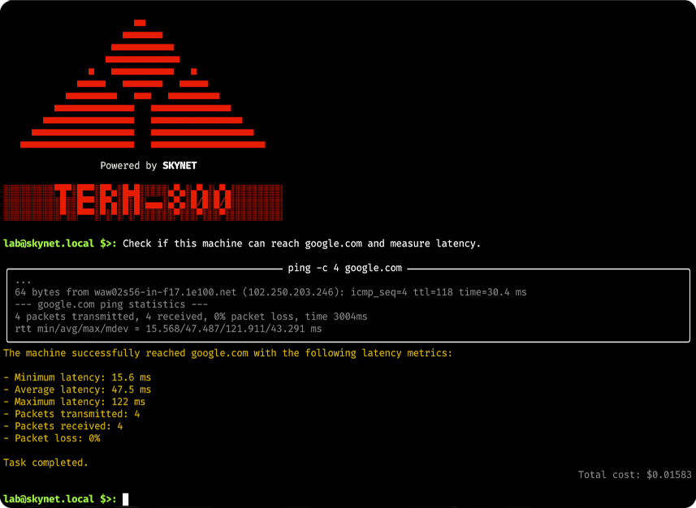

# Term-800: AI-based System Administrator

## Overview

**Term-800** is an AI-powered system administrator that connects to Linux servers via SSH to execute commands, retrieve system information, and automate tasks. Inspired by the T-800 from the Terminator movie, this project was created purely for fun.



*Term-800 is a powerful tool, but system administration is inherently complex. Ensuring security, reliability, and scalability requires careful oversight. While Term-800 can be helpful for small projects like Raspberry Pi setups or personal development environments, it should be used with caution. You are responsible for how you use it, so always verify commands and configurations before applying them to critical systems.*

## Key Features

- **Natural Language Interaction** - Communicates with you using natural language. You can define a task or objective, and **Term-800** will execute all necessary commands to achieve it.

- **SSH Connectivity** - Connects to remote hosts via SSH, supporting both key-based and password-based authentication.

- **Error Handling & Workarounds** - If issues arise, **Term-800** will attempt to resolve them or find a workaround.

- **Advanced Planning** - Uses chain-of-thought methods to enhance thinking capabilities, such as planning complex tasks before execution.

- **System Analysis & Insights** - Analyzes the system and answers questions about its configuration and status.

- **Execution Guardian** - Built-in supervision layer that prompts for confirmation before executing risky commands. The level of supervision is configurable.

- **Real-Time Logs** - Streams logs from the remote host, allowing you to see how commands progress.

- **Customizable AI Models** - Works with OpenAI LLM models (requires an API key). You can choose a compatible model you want to use.

- **Cost Summarization** - Tracks and summarizes the cost of operations performed.

## Usage

### Getting Started

Before starting Term-800, you need an **OpenAI API Key**. Store it in the `OPENAI_API_KEY` environment variable. If this variable is not set, Term-800 will ask for the API key and store it in a `.env` file for future use what can be pretty convenient.

### Connecting to a Remote Host

When you start Term-800, it will prompt you for:

- **Hostname** - The server you want to connect to.

- **Username** - The user account for SSH authentication.

- **Password (if needed)** - If key-based authentication is unavailable, Term-800 will ask for a password.

### Security Tips

- Use key-based SSH authentication.
- Restrict permissions with a limited-access user.

### Executing Tasks

Once connected, you can ask Term-800 questions or request tasks in natural language. For example:

```
lab@skynet.local $>: How much RAM does the host have?
lab@skynet.local $>: Install LAMP stack.
```

Term-800 will determine the necessary steps, execute commands, and stream logs from the remote host. After completion, it will provide a summary of the task.

### System Commands

Term-800 also supports a set of system commands for configuration and management. These commands start with /:

- `/help` - List all available system commands.

- `/bye` - Exit Term-800 and close the session.

- `/model` - Change the OpenAI model. Works well with `gpt-4o-mini`, but you can also choose more powerful and expensive models.

- `/clear` - Clear the conversation and action history. This resets Term-800's context, which can help start fresh or reduce costs (larger contexts require more tokens and increase OpenAI API costs).

- `/guard` - Configure the Execution Guardian for command supervision:

    - `on` - Every command must be confirmed by user.

    - `auto` - Only risky commands require confirmation.

    - `off` - No confirmation; Term-800 executes commands automatically

## Development Guide

The source code is available at: [GitHub Repository](https://github.com/jamro/term-800.git)

### Prerequisites

To set up Term-800 for development, ensure you have the following:

- **Python 3.8+**
- **Poetry** (Dependency management)
- **GNU Make** (Optional, but recommended)
- **OpenAI API Key** - visit [OpenAI](https://platform.openai.com) to get one.
- **SSH Access** to a test machine (e.g., Raspberry Pi or a remote Linux server)

### Installing Poetry

If you don't have **Poetry** installed, install it using:

```bash
pip install poetry
```

Verify the installation:

```bash
poetry --version
```

### Development Setup

#### Clone the Repository

```bash
git clone https://github.com/jamro/term-800.git
cd term-800
```

#### Install Dependencies

```bash
poetry install --no-root
```

#### Run Term-800 Locally

```bash
make run
```

#### Run Tests with Coverage

```bash
make test
```

or to run a specific test:

```bash
poetry run pytest -k "test_CmdChat_model_basic" -s
```

#### Code Quality Checks

Run the following to check formatting, linting, and type checking:

```bash
make check
```

This includes:

- **Black** - Auto-formatting.
- **Ruff** - Linting (with auto-fix support).
- **Mypy** - Type checking.


#### Serve Documentation Locally

```bash
make doc
```
Visit [http://localhost:8000](http://localhost:8000) to view the documentation.
